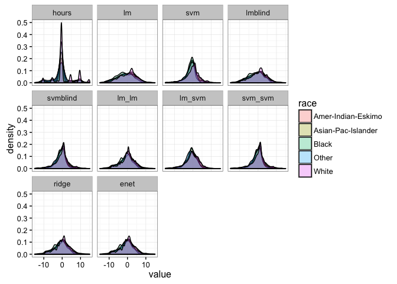

Fairness/causation: Adult dataset
================

Data
----

From the [UCI databases](https://archive.ics.uci.edu/ml/machine-learning-databases/adult/adult.names) Lichman (2013).

``` r
url <- "http://archive.ics.uci.edu/ml/machine-learning-databases/adult/adult.data"
adult <- read.csv(url, strip.white = TRUE, header = FALSE)
names(adult) <- c("age", "workclass", "fnlwgt", "education", "educationnum",
                  "maritalstatus", "occupation", "relationship", "race", "sex",
                  "capitalgain", "capitalloss", "hoursperweek",
                  "nativecountry", "income")
adult$fnlwght <- NULL # Survey weights -- for generalization
data <- adult[,c("workclass", "occupation", "education", "educationnum",
                 "nativecountry", "race", "sex", "age")]
meanhours <- mean(adult$hoursperweek)
data$hours <- adult$hoursperweek
res <- "hours"
prot <- c("sex", "race")
output <- data[,c(prot, res)]
t(head(data))[,1:3]
```

    ##               1               2                  3                  
    ## workclass     "State-gov"     "Self-emp-not-inc" "Private"          
    ## occupation    "Adm-clerical"  "Exec-managerial"  "Handlers-cleaners"
    ## education     "Bachelors"     "Bachelors"        "HS-grad"          
    ## educationnum  "13"            "13"               " 9"               
    ## nativecountry "United-States" "United-States"    "United-States"    
    ## race          "White"         "White"            "White"            
    ## sex           "Male"          "Male"             "Male"             
    ## age           "39"            "50"               "38"               
    ## hours         "40"            "13"               "40"

Imbalances in the data
----------------------

Average outcomes by sex/race.

``` r
data %>% group_by(sex) %>% summarise(count = n(), hours = mean(hours))
```

    ## # A tibble: 2 × 3
    ##      sex count    hours
    ##   <fctr> <int>    <dbl>
    ## 1 Female 10771 36.41036
    ## 2   Male 21790 42.42809

``` r
data %>% group_by(race) %>% summarise(count = n(), hours = mean(hours))
```

    ## # A tibble: 5 × 3
    ##                 race count    hours
    ##               <fctr> <int>    <dbl>
    ## 1 Amer-Indian-Eskimo   311 40.04823
    ## 2 Asian-Pac-Islander  1039 40.12705
    ## 3              Black  3124 38.42286
    ## 4              Other   271 39.46863
    ## 5              White 27816 40.68910

Distribution plot.

``` r
ggplot(data, aes(hours, linetype = sex)) + geom_density() + theme_bw()
```


``` r
data$hours <- adult$hoursperweek - meanhours
```

### Linear regression

Predicted averages coincide with data averages.

``` r
model.lm <- lm(hours ~ ., data)
output$lm <- predict(model.lm)

model.svm <- svm(hours ~ ., data)
output$svm <- predict(model.svm)
```

### Blinded to unfair covariates

Outcomes are only slightly less biased.

``` r
lm.blind <- fairpred_blind(data, res, prot, method = "lm")
output$lmblind <- predict(lm.blind)

svm.blind <- fairpred_blind(data, res, prot, method = "svm")
output$svmblind <- predict(svm.blind)
```

### Two-stage procedure

Greedily enforces fairness first, then builds predictions.

``` r
lm.lm <- fairpred_2s(data, res, prot, method1 = "lm", method2 = "lm")
output$lm_lm <- predict(lm.lm)

lm.svm <- fairpred_2s(data, res, prot, method1 = "lm", method2 = "svm")
output$lm_svm <- predict(lm.svm)

svm.lm <- fairpred_2s(data, res, prot, method1 = "svm", method2 = "lm")
output$svm_lm <- predict(svm.lm)

svm.svm <- fairpred_2s(data, res, prot, method1 = "svm", method2 = "svm")
output$svm_svm <- predict(svm.svm)
```

### Penalizing unprotected coefficients

``` r
ridge <- fairpred_pen(data, res, prot, alpha = 0)
output$ridge <- ridge$predictions

enet <- fairpred_pen(data, res, prot, alpha = .5)
output$enet <- enet$predictions
```

### Comparing imbalance

Subgroup means.

``` r
output <- output %>% mutate_if(is.numeric, funs(. + meanhours))

output %>% group_by(sex) %>%
  summarise_if(.predicate = function(v) is.numeric(v), .funs = funs("mean"))
```

    ## # A tibble: 2 × 12
    ##      sex    hours       lm      svm  lmblind svmblind    lm_lm   lm_svm
    ##   <fctr>    <dbl>    <dbl>    <dbl>    <dbl>    <dbl>    <dbl>    <dbl>
    ## 1 Female 36.41036 36.41036 37.96970 38.54483 39.10654 39.38567 39.78687
    ## 2   Male 42.42809 42.42809 41.33314 41.37300 40.77094 40.95736 40.31978
    ##     svm_lm  svm_svm    ridge     enet
    ##      <dbl>    <dbl>    <dbl>    <dbl>
    ## 1 38.98489 39.54358 39.15736 39.17757
    ## 2 41.77291 41.17074 41.07569 41.06574

``` r
output %>% group_by(race) %>%
  summarise_if(.predicate = function(v) is.numeric(v), .funs = funs("mean"))
```

    ## # A tibble: 5 × 12
    ##                 race    hours       lm      svm  lmblind svmblind    lm_lm
    ##               <fctr>    <dbl>    <dbl>    <dbl>    <dbl>    <dbl>    <dbl>
    ## 1 Amer-Indian-Eskimo 40.04823 40.04823 39.65349 39.71544 39.84587 39.69122
    ## 2 Asian-Pac-Islander 40.12705 40.12705 39.97327 40.41519 40.29010 40.57280
    ## 3              Black 38.42286 38.42286 39.01355 38.77550 39.45587 39.20871
    ## 4              Other 39.46863 39.46863 39.40944 39.52478 39.41919 39.70708
    ## 5              White 40.68910 40.68910 40.37957 40.64191 40.31562 40.58586
    ##     lm_svm   svm_lm  svm_svm    ridge     enet
    ##      <dbl>    <dbl>    <dbl>    <dbl>    <dbl>
    ## 1 39.66606 40.12912 40.25715 39.71402 39.71136
    ## 2 40.24041 40.82300 40.71374 40.77430 40.72481
    ## 3 39.62467 39.20687 39.88389 39.06084 39.07105
    ## 4 39.30419 39.94273 39.83582 39.63989 39.65129
    ## 5 40.21166 41.05321 40.72548 40.59963 40.60028

Distribution plots.

``` r
pd <- melt(output)
```

    ## Using sex, race as id variables

``` r
ggplot(pd, aes(value, fill = sex)) + geom_density(alpha = .3) +
  facet_wrap(~variable) + xlim(25, 55) + theme_bw()
```

    ## Warning: Removed 6204 rows containing non-finite values (stat_density).


``` r
ggplot(pd, aes(value, fill = race)) + geom_density(alpha = .3) +
  facet_wrap(~variable) + xlim(25, 55) + theme_bw()
```

    ## Warning: Removed 6204 rows containing non-finite values (stat_density).



### Comparing (in-sample) mean-squared prediction error

``` r
outputMSE <- data.frame((output$hours - output[,4:ncol(output)])^2)
outputMSE$const <- (output$hours-meanhours)^2
outputMSE %>% summarise_all("mean")
```

    ##         lm      svm  lmblind svmblind    lm_lm   lm_svm   svm_lm  svm_svm
    ## 1 129.6325 121.8658 132.4799  124.644 134.1809 127.4479 132.6524 124.7834
    ##      ridge    enet    const
    ## 1 133.4019 133.505 152.4543

Lichman, M. 2013. “UCI Machine Learning Repository.” University of California, Irvine, School of Information; Computer Sciences. <http://archive.ics.uci.edu/ml>.
