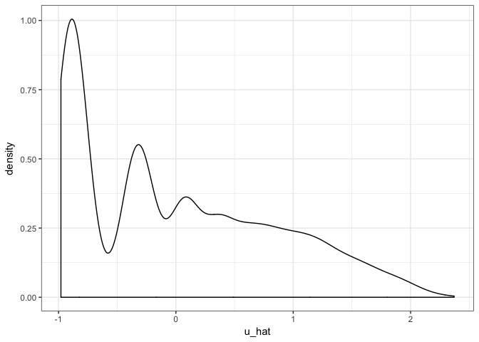
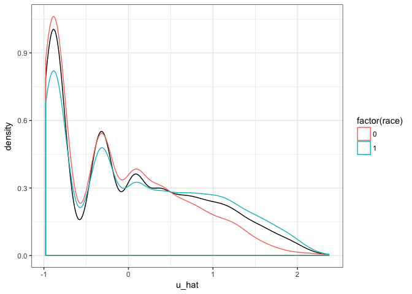

COMPAS analysis with latent criminality and selection
================

Write model here
----------------

We infer *U* using a Bayesian method

Load data
---------

``` r
data <- read.csv("compas_stan_results.csv")
head(data)
```

    ##   two_year_recid prior_counts s race         age gender      u_hat
    ## 1              0            0 1    1  2.93799934      0 -0.8694476
    ## 2              1            0 1    1 -0.04556419      0 -0.9074225
    ## 3              1            4 1    1 -0.89801091      0  0.5733961
    ## 4              0            0 1    1  0.80688253      0 -0.9367896
    ## 5              1           14 1    0  0.55114852      0  1.5794928
    ## 6              0            3 1    1  0.72163786      0  0.3535396

Plots of inferred latent criminality
------------------------------------


