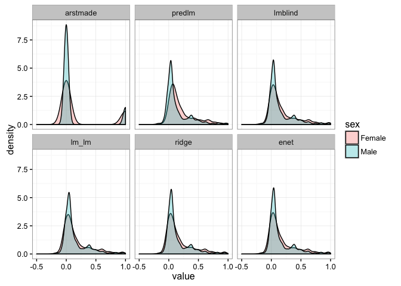
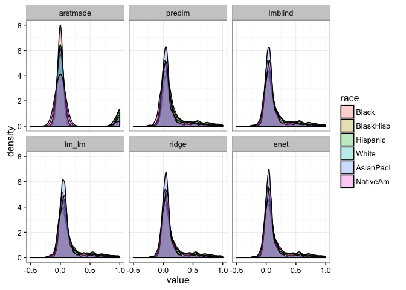

Fairness/causation: Stop and Frisk dataset
================

Data
----

From the [NYC Stop and Frisk dataset](http://www.nyclu.org/content/stop-and-frisk-data) (“NYC Stop and Frisk Data” 2014).

``` r
source("load_stopandfrisk.R")
data <- stopandfrisk
data$arstmade <- as.numeric(data$arstmade) -1
meanarst <- mean(data$arstmade)
data$arstmade <- data$arstmade - meanarst
output <- data[,c("race", "sex", "arstmade")]
res <- "arstmade"
prot <- c("race", "sex")
t(head(data))[,1:3]
```

    ##          1            2            3           
    ## pct      "67"         "7"          "84"        
    ## ser_num  "15"         "26"         "52"        
    ## timestop "2330"       "1530"       "2100"      
    ## city     "Brooklyn"   "Manhattan"  "Brooklyn"  
    ## sex      "Male"       "Male"       "Male"      
    ## race     "Black"      "Black"      "Black"     
    ## age      "18"         "31"         "16"        
    ## height   "67"         "67"         "68"        
    ## weight   "150"        "160"        "160"       
    ## haircolr "1"          "1"          "1"         
    ## eyecolor "2"          "2"          "2"         
    ## build    "medium"     "medium"     "thin"      
    ## frisked  "1"          "1"          "1"         
    ## searched "0"          "1"          "0"         
    ## contrabn "0"          "0"          "0"         
    ## arstmade "-0.1515108" " 0.8484892" "-0.1515108"
    ## sumissue "0"          "0"          "0"         
    ## detailcm "20"         "23"         "45"        
    ## perobs   "1"          "2"          "1"         
    ## perstop  " 5"         " 5"         "10"        
    ## inout    "0"          "1"          "1"         
    ## trhsloc  "0"          "2"          "0"         
    ## addrpct  "67"         " 7"         "84"        
    ## sector   " 7"         " 2"         " 6"        
    ## xcoord   "1000633"    " 987521"    " 988579"   
    ## ycoord   "176542"     "201066"     "191174"    
    ## typeofid "2"          "1"          "1"         
    ## othpers  "1"          "0"          "1"         
    ## explnstp "1"          "1"          "1"         
    ## offunif  "0"          "0"          "0"         
    ## offverb  "0"          "1"          "1"         
    ## officrid "0"          "0"          "0"         
    ## offshld  "1"          "1"          "1"         
    ## radio    "0"          "0"          "0"         
    ## recstat  "1"          "1"          "0"

Imbalances in the data
----------------------

Average outcomes by race.

``` r
data %>% group_by(race) %>% summarise(count = n(), arstmade = meanarst + mean(arstmade))
```

    ## # A tibble: 6 × 3
    ##        race count   arstmade
    ##      <fctr> <int>      <dbl>
    ## 1     Black 22690 0.14354341
    ## 2 BlaskHisp  2583 0.20867209
    ## 3  Hispanic  8994 0.18412275
    ## 4     White  4952 0.12338449
    ## 5 AsianPacI  2136 0.10065543
    ## 6  NativeAm   180 0.08333333

### Linear regression

Predicted averages coincide with data averages.

``` r
model.lm <- lm(arstmade ~ .-1, data)
output$predlm <- predict(model.lm)
```

### Blinded to unfair covariates

Outcomes are only slightly less biased.

``` r
lm.blind <- fairpred_blind(data, res, prot, method = "lm")
output$lmblind <- predict(lm.blind)
```

### Two-stage procedure

Greedily enforces fairness first, then builds predictions.

``` r
lm.lm <- fairpred_2s(data, res, prot, method1 = "lm", method2 = "lm")
output$lm_lm <- predict(lm.lm)
```

### Penalizing unprotected coefficients

``` r
ridge <- fairpred_pen(data, res, prot, alpha = 0)
output$ridge <- ridge$predictions

enet <- fairpred_pen(data, res, prot, alpha = .5)
output$enet <- enet$predictions
```

### Comparing imbalance

Subgroup means.

``` r
output <- output %>% mutate_if(is.numeric, funs(. + meanarst))
output %>% group_by(race) %>% summarise_if(is.numeric, .funs = funs("mean"))
```

    ## # A tibble: 6 × 7
    ##        race   arstmade     predlm   lmblind      lm_lm      ridge
    ##      <fctr>      <dbl>      <dbl>     <dbl>      <dbl>      <dbl>
    ## 1     Black 0.14354341 0.14354341 0.1467821 0.14841448 0.14845422
    ## 2 BlaskHisp 0.20867209 0.20867209 0.1886599 0.17958017 0.18567063
    ## 3  Hispanic 0.18412275 0.18412275 0.1796708 0.17293324 0.17636902
    ## 4     White 0.12338449 0.12338449 0.1253887 0.13238283 0.12505270
    ## 5 AsianPacI 0.10065543 0.10065543 0.1037288 0.10918656 0.10281529
    ## 6  NativeAm 0.08333333 0.08333333 0.0930949 0.09708883 0.09455743
    ##         enet
    ##        <dbl>
    ## 1 0.14859789
    ## 2 0.18609810
    ## 3 0.17671427
    ## 4 0.12368634
    ## 5 0.10323532
    ## 6 0.09423189

Distribution plots.

``` r
pd <- melt(output)
```

    ## Using race, sex as id variables

``` r
ggplot(pd, aes(value, fill = sex)) + geom_density(alpha = .3) +
  facet_wrap(~variable) + xlim(-.5, 1) + theme_bw()
```

    ## Warning: Removed 1923 rows containing non-finite values (stat_density).



``` r
ggplot(pd, aes(value, fill = race)) + geom_density(alpha = .3) +
  facet_wrap(~variable) + xlim(-.5, 1) + theme_bw()
```

    ## Warning: Removed 1923 rows containing non-finite values (stat_density).



### Comparing (in-sample) mean-squared prediction error

``` r
outputMSE <- data.frame((output$arstmade - output[,4:ncol(output)])^2)
outputMSE$const <- output$arstmade^2
outputMSE %>% summarise_all("mean")
```

    ##       predlm   lmblind      lm_lm      ridge       enet     const
    ## 1 0.07490494 0.0750383 0.07523581 0.07514535 0.07510581 0.1515108

“NYC Stop and Frisk Data.” 2014. NYCLU. <http://www.nyclu.org/content/stop-and-frisk-data>.
